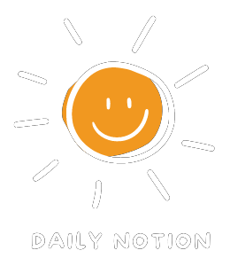
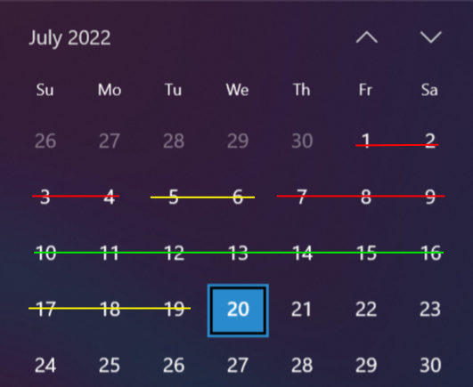

# Overview
Notion is a popular productivity app used for note-taking, knowledge database storage, and team collaboration. Although Notion enables us to be more productive, most of us still struggle with using it to get work done. Notion has lots of features designed for people with highly efficient work habits, but most of us are just struggling to regularly check our workspace let alone use such features. 

Daily Notion was built with these types of users in mind. Our team designed the app based off a simple idea: if we can narrow down your biggest productivity hurdle, which can range from procrastination to negative thinking, we can offer a curated solution. Through a combination of asking relevant questions, tracking daily mood, and analyzing Notion workspace metadata, we believe our app can help you stay on track to complete your latest project goals.  


# Requirements
(Rough draft) Have Node installed. Then:  
```
npm install
npm start
```
# How it works
Upon registration, fill out our productivity questionnaire. We know some questions may not have a definite answer, but choose the option(s) that best fits your situation. Your answers will help give us a rough idea on your work style. As time passes and your work style changes, feel free to update your questionnaire responses. Based off your reponses, we will give you a Notion template that you should fill out on a weekly basis.  

Now that you are in the home page, we can start gathering mood data. We believe there is a strong correlation between mood and productivity. On a daily basis, remember to record your overall mood for the day.  

Finally, the core of our application is built around analysis of your Notion workspace. Input the start date and end date for your next project. Then, grant us access to your workspace by inputing relevant tokens. From now on, use this workspace to work toward your project goals. Daily Notion interacts with the Notion API to gather metadata, so we'll know if your working or not.  

Everyday, check out the home page. We'll try to give updates on how you're doing and even provide recommendations.  


# Languages
This project is written in NodeJS and React.
# Credits
Jay Quedado, Michael Salamon