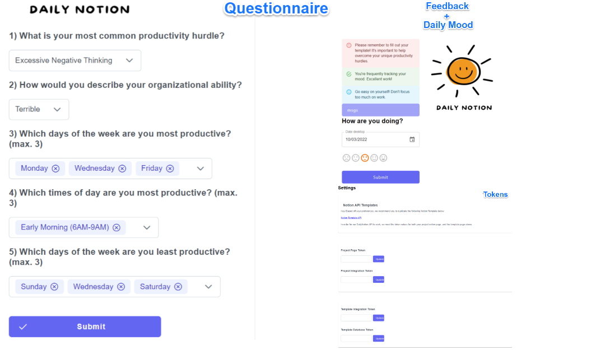
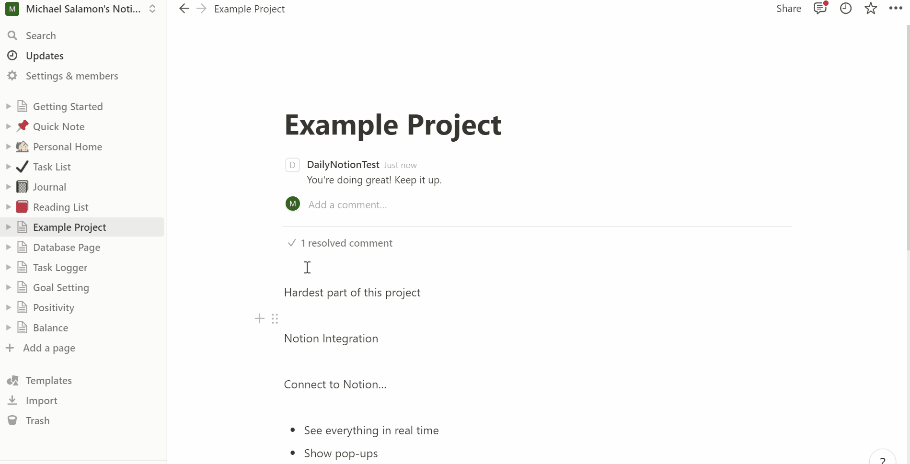
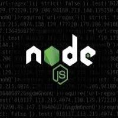
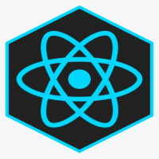
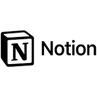

# Overview
Notion is a popular productivity app used for note-taking, knowledge database storage, and team collaboration. Although Notion enables us to be more productive, most of us still struggle with using it to get work done. Notion has lots of features designed for people with highly efficient work habits, but most of us are just struggling to regularly check our workspace let alone use such features. 

DailyNotion was built with these types of users in mind. Our team designed the app based off a simple idea: if we can narrow down your biggest productivity hurdle, which can range from procrastination to negative thinking, we can offer a curated solution. Through a combination of asking relevant questions, tracking daily mood, and analyzing Notion workspace metadata, we believe our app can help you stay on track to complete your latest project goals.  


# Requirements
To launch the web app, run the following commands. 
```
npm install
npm start
```  
 Run the backend once daily to ensure all registered users receive up-to-date feedback:  
```
node backend/feedback_cron.js
```
# How it works
As part of the registration process, the user must fill out a questionnaire. We think it's important to narrow down their biggest productivity hurdle, and days of week/times of day they are/aren't productive. Answers to these questions will affect user feedback.  

Once the account is set-up, the user is expected to give notion tokens for 2 pages that will be tracked: a template database and a project page. Our app gives a link to a curated template based on the users productivity hurdle response. The user is expected to duplicate this template to their own Notion account and fill it out on a weekly basis. The project page is of their own creation and can follow any format. To identify all 4 Notion tokens, read backend/README.md.  

At this point, all necessary information has been provided. From now on, the user can login to submit their daily mood from a scale of 1-5.  

The backend will continually update user feedback on a daily basis. These messages will be displayed in the web app and also as a comment in the project page. Feedback is meant to tell the user what they're doing good or what they're doing wrong.  

Putting everything together, our app positively influences user behavior by encouraging 3 practices: consistency, awareness, and reflection.  
- Consistancy in tracking mood and making edits to project page
- Awareness by reading feedback messages concerning their progress
- Reflection by giving responses to the questionnaire and answering open-ended questions in the template  


# Languages/Dependencies
This project is written in NodeJS and React. User data is stored in Firebase. Notion workspace data is extracted using the Notion API NodeJS SDK.  




# Credits
Jay Quedado, Michael Salamon